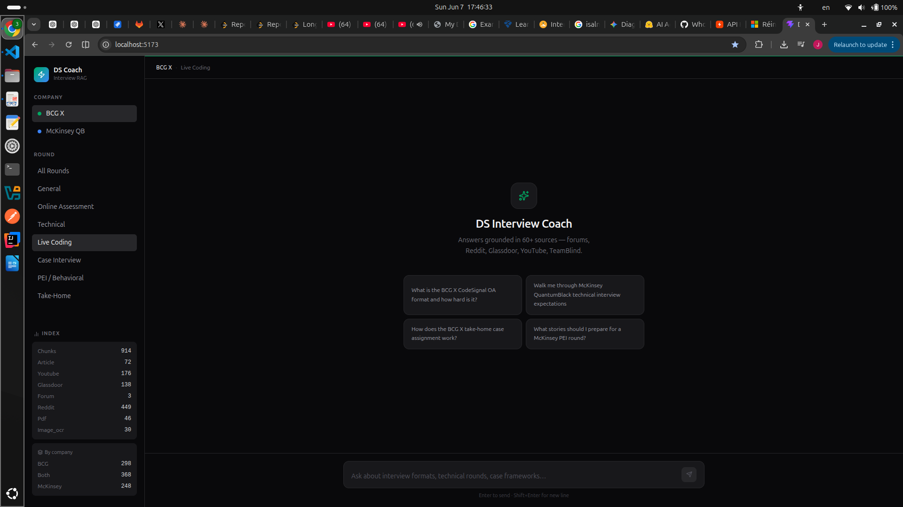
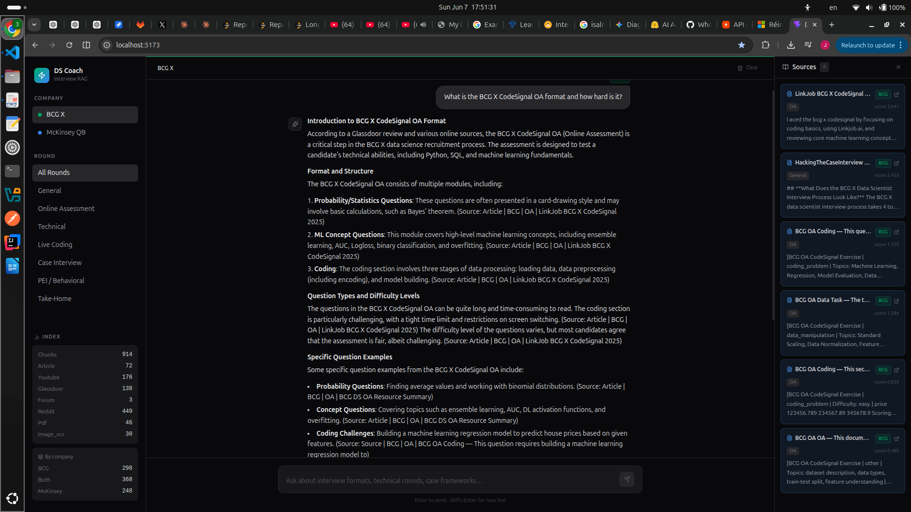

<div align="center">

# DS Interview Coach

**An advanced RAG-powered assistant for BCG X & McKinsey QuantumBlack Data Science interview preparation**

[](https://python.org)
[](https://fastapi.tiangolo.com)
[](https://react.dev)
[](https://anthropic.com)

*Answers grounded in 900+ chunks from forums, Reddit, Glassdoor, YouTube, and real OA screenshots*

</div>

---

## What It Does

DS Interview Coach is a retrieval-augmented generation (RAG) system that answers interview preparation questions specifically for **BCG X (formerly BCG GAMMA)** and **McKinsey QuantumBlack** Data Science & Analytics roles. Unlike generic prep resources, every answer is sourced from real candidate experiences, Glassdoor reviews, YouTube walkthroughs, and actual online assessment screenshots.

**Filter by company and round type** — get targeted answers for OA, Technical, Live Coding, Case, PEI, or Take-Home rounds.

---

## Screenshots

### Main Interface


*Left sidebar shows company filter (BCG X / McKinsey QB), round type, and live index stats (914 chunks across 72 articles, 176 YouTube transcripts, 138 Glassdoor reviews, 449 Reddit threads, 30 OA screenshots).*

### Example Conversation


*Streaming answer with structured breakdown of the BCG X CodeSignal OA format — probability/statistics questions, ML concepts, and coding challenges — sourced from actual candidate reports.*

---

## Example Questions

| Question | Company | Round |
|----------|---------|-------|
| *"What is the BCG X CodeSignal OA format and how hard is it?"* | BCG X | Online Assessment |
| *"Walk me through McKinsey QuantumBlack technical interview expectations"* | McKinsey QB | Technical |
| *"How does the BCG X take-home case assignment work?"* | BCG X | Take-Home |
| *"What stories should I prepare for a McKinsey PEI round?"* | McKinsey QB | PEI / Behavioral |
| *"What Python and SQL skills does BCG X actually test in the pair programming round?"* | BCG X | Live Coding |
| *"How is the McKinsey HackerRank OA structured compared to BCG CodeSignal?"* | Both | Online Assessment |

---

## Architecture

```
Scraping (60+ sources)
  ↓  Reddit · YouTube · Glassdoor · Forums · OA Screenshots
data/raw/{company}/{round_type}/*.json

Processing
  ↓  Gemini 2.5 Flash vision → OA screenshot metadata
  ↓  Semantic chunking (tiktoken, adaptive by source type)
  ↓  Q&A-aware splitting for technical question files

Vector Index  data/embeddings/
  ├── FAISS (bge-large-en-v1.5, 1024-dim, cosine)
  └── BM25 (rank_bm25)

Retriever  src/rag/retriever.py
  1. Multi-query expansion (Groq Llama 3.1)
  2. HyDE — hypothetical document embedding
  3. Dual search: BM25 + FAISS on all query variants
  4. RRF fusion (k=60) → cross-encoder reranking (ms-marco-MiniLM-L-12-v2) → top-6

Generator  src/rag/generator.py
  Claude Sonnet · prompt caching · SSE streaming

API  POST /api/chat  →  FastAPI
Frontend  React + TypeScript + Vite
```

---

## Data Sources

| Source | Type | Content |
|--------|------|---------|
| Glassdoor BCG & McKinsey | Reviews | 138 interview reviews |
| Reddit (r/datascience, r/consulting…) | Threads | 449 chunks, full comment trees |
| YouTube | Transcripts | 21 videos, Whisper-transcribed |
| OA Screenshots | Vision OCR | 30 chunks — real CodeSignal & HackerRank questions |
| DataInterview, HackingTheCaseInterview | Articles | Detailed role-specific guides |
| DataLemur Q&A | Technical Q&A | Per-question retrieval with topic tagging |
| PDFs & Take-Home Cases | Documents | BCG X official materials |

> **Domain filter is strict**: Data Engineering content (Spark, Kafka, Airflow, dbt…) is excluded at scrape time. Only DS/Analytics roles are indexed.

---

## Tech Stack

| Layer | Technology |
|-------|-----------|
| Embeddings | `BAAI/bge-large-en-v1.5` (1024-dim) |
| Reranker | `cross-encoder/ms-marco-MiniLM-L-12-v2` |
| LLM | Claude Sonnet 4 (Anthropic) |
| Query expansion / HyDE | Groq Llama 3.1 8B Instant |
| OA vision extraction | Gemini 2.5 Flash → Groq Llama 4 Scout fallback |
| Vector store | FAISS + rank-bm25 |
| Backend | FastAPI · Python 3.11 |
| Frontend | React 18 · TypeScript · Vite |

---

## Setup

### Prerequisites

```bash
pip install -r requirements.txt
playwright install chromium
```

### Environment variables (`.env` in root)

```env
ANTHROPIC_API_KEY=...
GROQ_API_KEY=...
GEMINI_API_KEY=...          # for OA screenshot extraction
REDDIT_CLIENT_ID=...
REDDIT_CLIENT_SECRET=...
REDDIT_USER_AGENT=...
```

### Build the index

```bash
# Option A — use pre-scraped data (if data/raw/ is populated)
python build_index.py

# Option B — scrape from scratch (~1h) then index
cd src/scraping
python run_all.py
cd ../..
python build_index.py
```

### Run

```bash
# Backend
uvicorn src.api.main:app --reload --port 8000

# Frontend (separate terminal)
cd frontend && npm install && npm run dev
# → http://localhost:5173
```

---

## API

`POST /api/chat`

```json
{
  "query": "How does the BCG X CodeSignal OA work?",
  "company": "BCG",
  "round_type": "OA",
  "use_hyde": true,
  "use_multi_query": true
}
```

Returns SSE stream:
```
data: {"type": "sources", "sources": [...]}
data: {"type": "token", "content": "The BCG X..."}
data: {"type": "done"}
```

---

## Project Structure

```
├── build_index.py          # Build FAISS + BM25 index from raw data
├── src/
│   ├── scraping/           # 5-phase scraper (forums, Reddit, YouTube, TeamBlind, Glassdoor)
│   │   └── scraper_config.py   # All targets, keywords, search configs
│   ├── processing/
│   │   ├── multimodal.py   # Gemini vision extraction for OA screenshots, PDFs, TXT
│   │   ├── chunker.py      # Adaptive chunking with Q&A splitting & OA context prefixes
│   │   └── loader.py       # Document loading, quality scoring, per-source filtering
│   ├── rag/
│   │   ├── retriever.py    # 4-stage hybrid retrieval (multi-query + HyDE + RRF + rerank)
│   │   ├── generator.py    # Claude streaming with prompt caching
│   │   └── embedder.py     # bge-large-en-v1.5 with query prefix
│   └── api/main.py         # FastAPI endpoints
├── frontend/               # React + TypeScript + Vite
└── docs/                   # UI screenshots
```

---

## License

MIT
